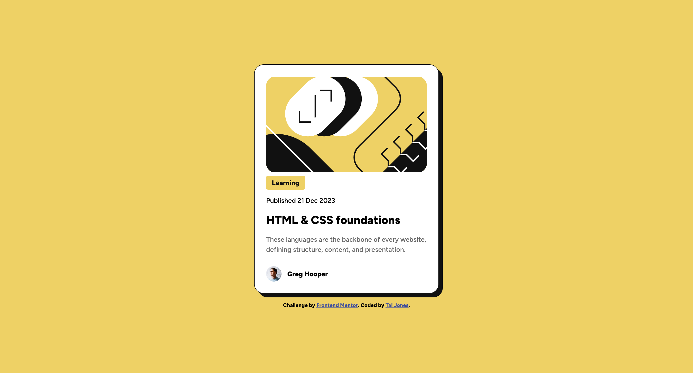

# Frontend Mentor - Blog preview card solution

This is a solution to the [Blog preview card challenge on Frontend Mentor](https://www.frontendmentor.io/challenges/blog-preview-card-ckPaj01IcS). Frontend Mentor challenges help you improve your coding skills by building realistic projects.

## Table of contents

- [Overview](#overview)
  - [Screenshot](#screenshot)
  - [Links](#links)
- [My process](#my-process)
  - [Built with](#built-with)
- [Author](#author) \*

## Overview

The goal of this project was to create a card with html and css.

### Screenshot

### Links

- Solution URL: [Github](https://github.com/ProgramJones/Blog-Preview-Card)
- Live Site URL: [Frontend Mentor](https://www.frontendmentor.io/profile/ProgramJones)

## My process

1. Reviewed the figma design file.
2. Added generic variables and classes to index.css.
3. Added the html structure.
4. Added specific styles to elements.

### Built with

- HTML
- CSS
- Flexbox

## Author

- Frontend Mentor - [@ProgramJones](https://www.frontendmentor.io/profile/ProgramJones)
